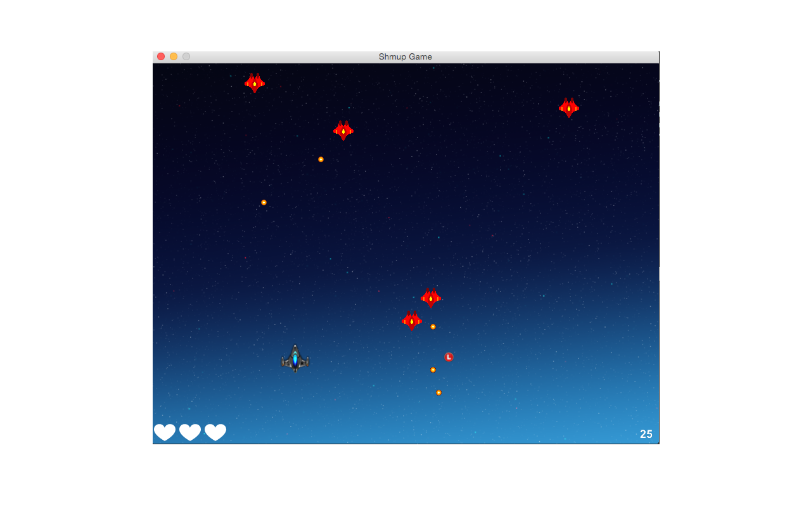

## Gosu Shoot 'em up

This is a work in progress shoot 'em up.
It uses [Gosu](https://www.libgosu.org/) and Ruby, and should be cross-platform.

You need to install a recent ruby version (tested on ruby 2.1) and Gosu (instructions on Gosu's [wiki page](https://github.com/gosu/gosu/wiki)).

